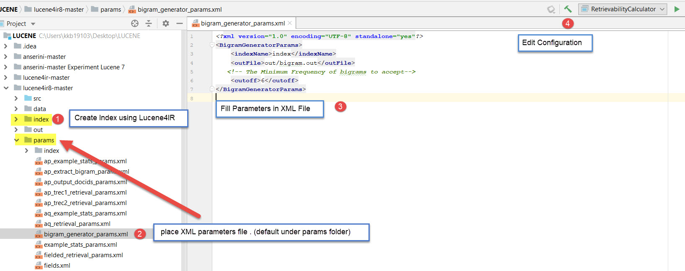
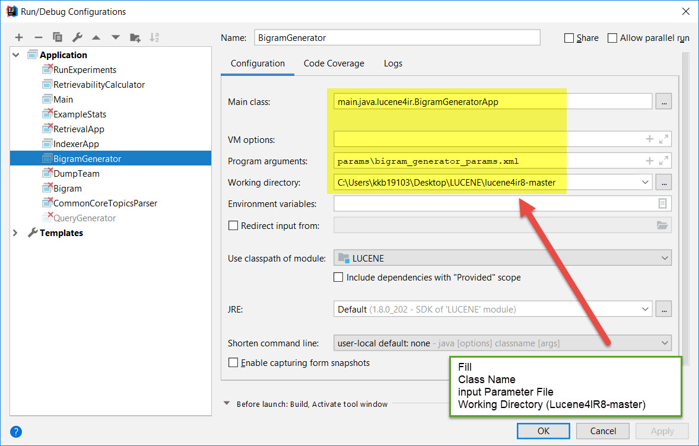

Bigram Generator
================
---------
Short Description :
--------
- Bigram Generator is a java class that is used to extract bigrams from a Lucene index and calculate their scores . 
- It outputs : (bigramID - bigram - term1(frequency) - term2(frequency) - bigram frequency - bigram score).
- The score is calculated based on ***Mutual Information*** formula from the following book :
   
  https://www.cs.vassar.edu/~cs366/docs/Manning_Schuetze_StatisticalNLP.pdf
   
  Browser Page (206) - Paper Page (178)
   
- It is developed as a part of [Lucene4IR](https://github.com/lucene4ir/lucene4ir8) 

Process Schema :
-------------
This is the workflow (Process schema) of the application :
 
 

- Steps 1 and 2 ( Creating the index perferraly using AppIndexer from [Lucene4IR](https://github.com/lucene4ir/lucene4ir8) )
- Steps (3 and 4) show the work of the Generator 

Usage :
--------------
in order to use the class , do the following :
 
1. Create Index 
2. Place parameter XML File 
3. Fill parameters in XML File 
4. Run 

